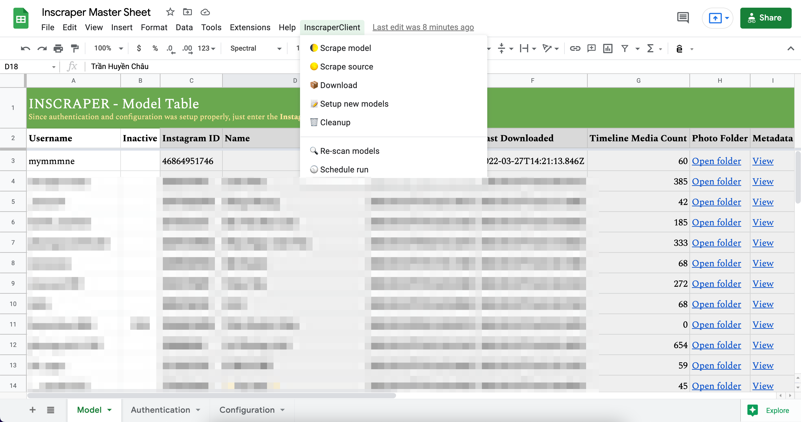
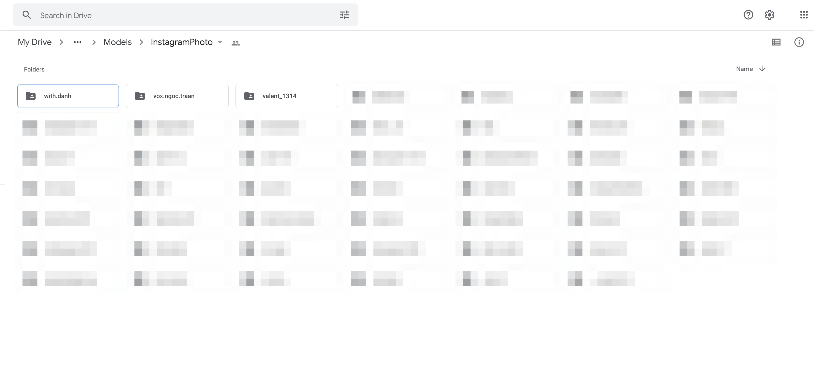

# Inscraper Client

Inscraper Client is a Google Spreadsheet add-on automatically fetch Instagram user photos, videos and keep track in a spreadsheet. It is a Google App Script project written in Javascript. _I write this project for learning purpose only_.  

## How it works

This add-on is integrated with an "Insraper Master Sheet" as we can see above.  
So to use this, we need to **clone the master sheet**, step-by-steps **define configuration, authentication and all your favorite idols**.  
  
If every was fine, the add-on provide you few command on the media to fetch, download the photos and videos. All of this will store in your Google Drive folder.
